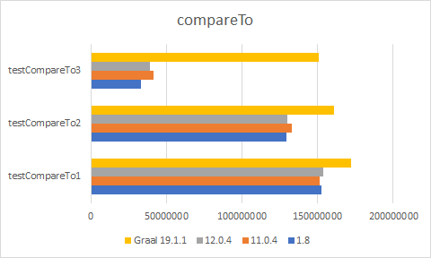
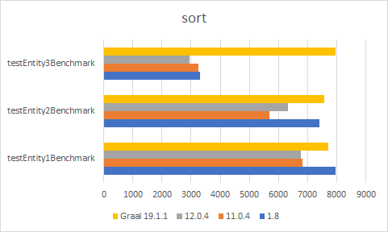

# Comparing Performance of lambdas

Consider the following tradition code when implementing a comparator for an entity.

```kotlin
data class Test1Entity(
		val field1: String,
		val field2: Long,
		val field3: Double,
		val date1: Date,
		val date2: Date
) : Comparable<Test1Entity> {

	override fun compareTo(other: Test1Entity): Int {
		var result = this.field1.compareTo(other.field1)
		if (result == 0) {
			result = this.field2.compareTo(other.field2)
			if (result == 0) {
				result = this.field3.compareTo(other.field3)
				if (result == 0) {
					result = this.date1.compareTo(date1)
					if (result == 0) {
						return this.date2.compareTo(other.date2)
					}
				}
			}
		}
		return result
	}
}
```
Or when trying to avoid immutable.
```kotlin
data class Test1Entity(
		val field1: String,
		val field2: Long,
		val field3: Double,
		val date1: Date,
		val date2: Date
) : Comparable<Test1Entity> {

	override fun compareTo(other: Test1Entity): Int {
		val result = this.field1.compareTo(other.field1)
		if (result == 0) {
			val result2 = this.field2.compareTo(other.field2)
			if (result2 == 0) {
				val result3 = this.field3.compareTo(other.field3)
				if (result3 == 0) {
					val result4 = this.date1.compareTo(date1)
					if (result4 == 0) {
						return this.date2.compareTo(other.date2)
					} else {
						return result4
					}
				} else {
					return result3
				}
			} else {
				return result2
			}
		}
		return result
	}
}
```

When using a construct like this it reads easier and shouldn't provide a runtime penalty.

```kotlin
inline fun <T> T.ifZero(exp: Int, block: () -> Int): Int = if (exp == 0) block() else exp

data class Test2Entity(
		val field1: String,
		val field2: Long,
		val field3: Double,
		val date1: Date,
		val date2: Date
) : Comparable<Test2Entity> {

	override fun compareTo(other: Test2Entity): Int =
			ifZero(field1.compareTo(other.field1)) {
				ifZero(field2.compareTo(other.field2)) {
					ifZero(field3.compareTo(other.field3)) {
						ifZero(date1.compareTo(other.date1)) {
							date2.compareTo(other.date2)
						}
					}
				}
			}


}
```

# Executing
```bash
./gradlew jmhJar
java -jar build/libs/kotlin-immutability-performance-jmh.jar
```
# Benchmarks

## Charts

*Results show operations/second. So higher is better*

### CompareTo Benchmark


### Sorting Benchmark



## Raw results
### JDK 1.8.0_222
```
Benchmark                                  Mode  Cnt          Score          Error  Units
EntitySortBenchmark.testCompareTo1        thrpt    5  152486824.222 ±  1039186.014  ops/s
EntitySortBenchmark.testCompareTo2        thrpt    5  129070695.342 ± 60250933.000  ops/s
EntitySortBenchmark.testCompareTo3        thrpt    5   33101647.521 ±  8241812.349  ops/s
EntitySortBenchmark.testEntity1Benchmark  thrpt    5       7944.836 ±      728.992  ops/s
EntitySortBenchmark.testEntity2Benchmark  thrpt    5       7398.933 ±      439.550  ops/s
EntitySortBenchmark.testEntity3Benchmark  thrpt    5       3307.690 ±       81.216  ops/s
```

### JDK 11.0.4
```
Benchmark                                  Mode  Cnt          Score         Error  Units
EntitySortBenchmark.testCompareTo1        thrpt    5  151576731.279 ± 1512631.692  ops/s
EntitySortBenchmark.testCompareTo2        thrpt    5  133113256.894 ± 2034327.058  ops/s
EntitySortBenchmark.testCompareTo3        thrpt    5   41435061.844 ± 1109035.074  ops/s
EntitySortBenchmark.testEntity1Benchmark  thrpt    5       6823.694 ±     240.065  ops/s
EntitySortBenchmark.testEntity2Benchmark  thrpt    5       5690.632 ±    2288.121  ops/s
EntitySortBenchmark.testEntity3Benchmark  thrpt    5       3247.631 ±     150.242  ops/s
```

### JDK 12.0.2
```
Benchmark                                  Mode  Cnt          Score         Error  Units
EntitySortBenchmark.testCompareTo1        thrpt    5  153702052.915 ± 1894629.525  ops/s
EntitySortBenchmark.testCompareTo2        thrpt    5  130079997.037 ± 1632301.585  ops/s
EntitySortBenchmark.testCompareTo3        thrpt    5   39224254.427 ± 1146574.992  ops/s
EntitySortBenchmark.testEntity1Benchmark  thrpt    5       6760.718 ±     349.851  ops/s
EntitySortBenchmark.testEntity2Benchmark  thrpt    5       6310.201 ±      90.302  ops/s
EntitySortBenchmark.testEntity3Benchmark  thrpt    5       2957.105 ±     133.031  ops/s
```

### JDK Graal VM 19.1.1
```
Benchmark                                  Mode  Cnt          Score          Error  Units
EntitySortBenchmark.testCompareTo1        thrpt    5  172002382.341 ±  3085169.726  ops/s
EntitySortBenchmark.testCompareTo2        thrpt    5  160855617.765 ±  4376920.422  ops/s
EntitySortBenchmark.testCompareTo3        thrpt    5  150741976.746 ± 20359301.136  ops/s
EntitySortBenchmark.testEntity1Benchmark  thrpt    5       7713.891 ±      497.388  ops/s
EntitySortBenchmark.testEntity2Benchmark  thrpt    5       7563.076 ±      757.518  ops/s
EntitySortBenchmark.testEntity3Benchmark  thrpt    5       7966.877 ±      193.780  ops/s
```

